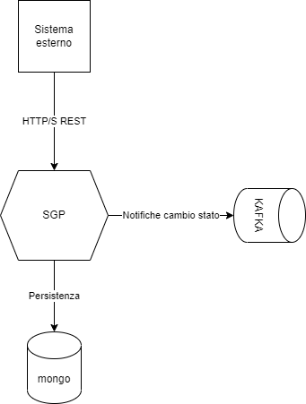

# SGP

Il micorservizio SGP (Sccenario per Gestione pratiche) ha come oggetto di dominio la Pratica (da ora Paperwork). 
E' un multimodule maven ed è suddiviso in tre moduli funzionali. ***sgp-application-api*** implementa i 
controller per le rotte REST associate al microservizio. ***sgp-application-mongodb*** si occupa della persistenza dei dati
su database non relazionale mongodb. ***sgp-application-outbound-event*** si occupa della pubblicazione di messaggi su code kafka
per la segnalazione dei passaggi di stato del Paperwork.

L'ogetto **Paperwork** è strutturato come segue:

```
  private String identifier;
  private String name;
  private String surname;
  private String taxCode;
  private Instant dateOfBirth;
  private String docPath;
  private List<PaperworkStatusInfo> paperworkStatusInfos = new ArrayList<>();
```

E' identificato univocamente da un identificatore, contiene l'anagrafica dell'utente che lo ha creato, un riferimento 
alla posizione su disco dell'allegato PDF associato al Paperwork e la lista degli stati che ha attraversato il Paperwork 
(il Paperwork ha un ciclo di vita che prevede passaggi di stato predefiniti, simili ad una macchina a stati finiti).

Il microservizio tramite sgp-application-api implementa due controller il primo ***PaperworkController*** espone rotte per la creazione, 
consultazione, modifica e download dell'allegato di un Paperwork.
Il secondo controller ***PaperworkLifeCycleController*** espone rotte per la gestione del ciclo di vita di un Paperwork.

Gli ***entry point*** logici del microservizio sono i due controller REST.

L'architettura può essere rappresentata con il diagramma in figura:


